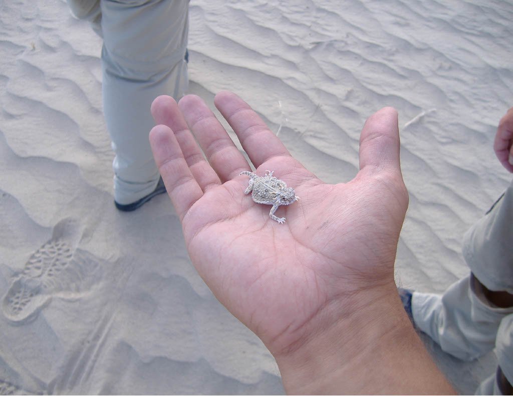
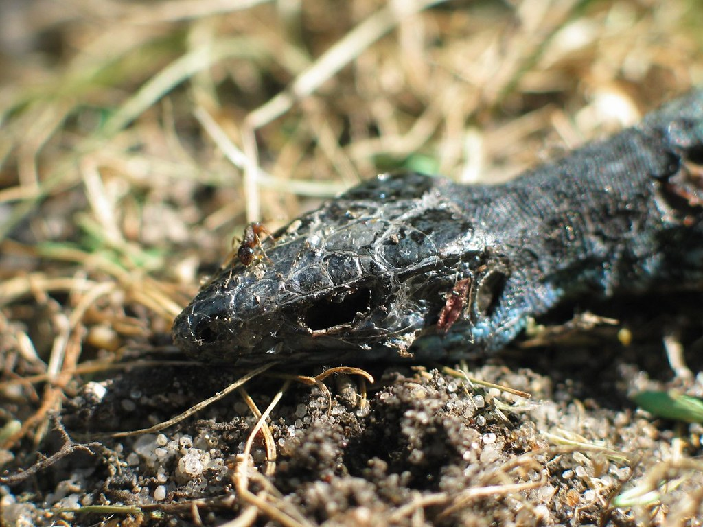
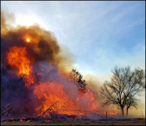
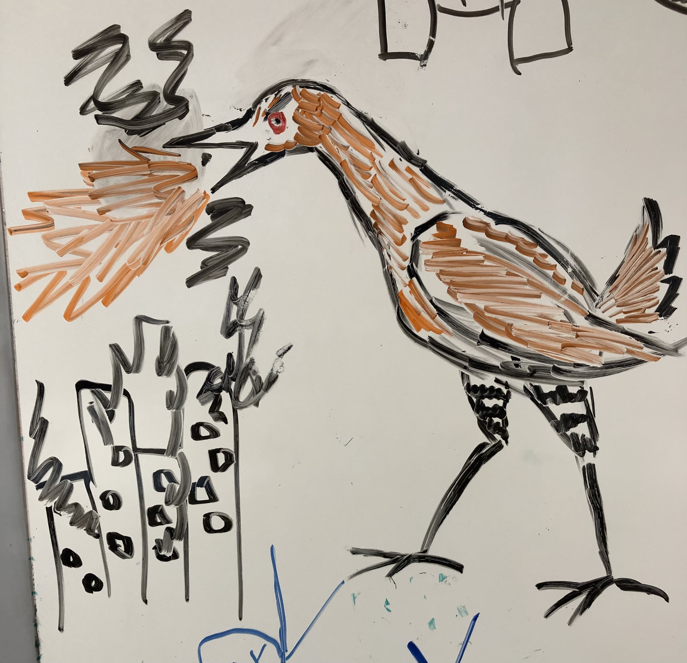
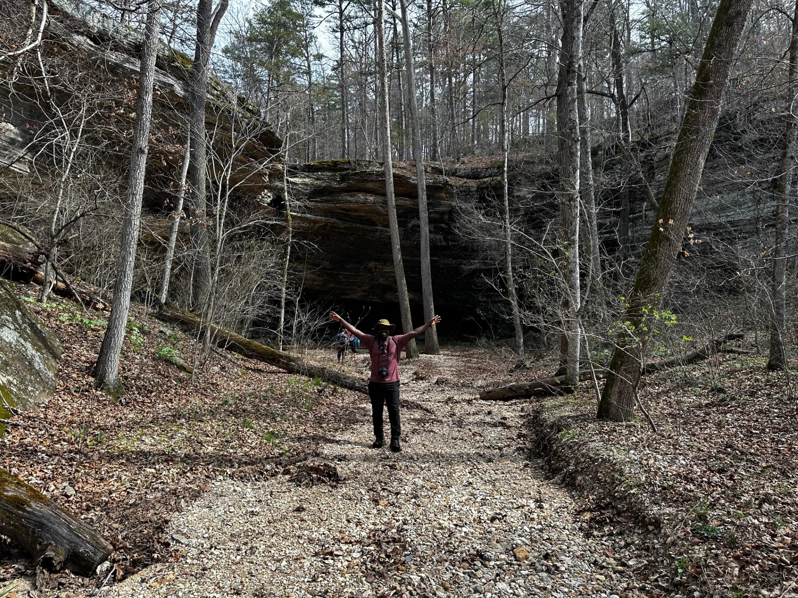

```{r setup, include=FALSE}
knitr::opts_chunk$set(message=FALSE,warning=FALSE, cache=TRUE)
```

At the Living Landscapes Lab, we encourage cross-disciplinary work, creativity, and science communication. We also acknowledge that there are many ways of knowing. Here are some projects, hobbies, and random artwork we do:

### Creative Non-fiction

----

<div class="row">
<div class="col-sm-8">

#### [*Capture Mark Recapture*](https://www.terrain.org/2021/nonfiction/capture-mark-recapture/)

An essay by Caleb Roberts. Published at Terrain.org.

Photo by Caleb Roberts. 


</div>
<div class="col-sm-4">
```{r cmr, out.width='100%', echo=F}

```
</div>
</div>

----

<div class="row">
<div class="col-sm-8">


#### [*I Want to Know Why I Kill*](https://www.thefourthriver.com/o7-content/2020/2/21/i-want-to-know-why-i-kill)

An essay by Caleb Roberts. Published at The Fourth River.

Photo by Axel Rouvin (CC BY 2.0). 


</div>
<div class="col-sm-4">
```{r vo, out.width='100%', echo=F}

```
</div>
</div>

----

<div class="row">
<div class="col-sm-8">

#### [*To Hold a Beautiful, Burning Snake*](https://www.terrain.org/2018/nonfiction/hold-beautiful-burning-snake/)

An essay by Caleb Roberts. Published at Terrain.org.

Photo by Christine Chitwood. 


</div>
<div class="col-sm-4">
```{r rs, out.width='100%', echo=F}

```
</div>
</div>


----

### Artwork

----

<div class="row">
<div class="col-sm-8">

#### King Rail-zilla

Probably by Jess Schmit.

Photo by Caleb Roberts.

---

</div>
<div class="col-sm-4">
```{r KingRailZilla, out.width='100%', echo=F}

```
</div>
</div>

----

### Lab Trips

----

<div class="row">
<div class="col-sm-8">

#### Kettle Falls Hike: 2024

Paul Akpejeluh in front of Kettle Falls... which was dry that day.

Photo by Paul Akpejeluh

</div>
<div class="col-sm-4">
```{r KettleFallsPaul, out.width='100%', echo=F}

```
</div>
</div>

---

<div class="row">
<div class="col-sm-8">

<!-- ### [things](https://crumplab.github.io/things/) -->

<!-- When I find to make visual things I take pictures of them, and post them here <https://crumplab.github.io/things/> -->

<!-- </div> -->
<!-- <div class="col-sm-4"> -->
<!-- ```{r things, out.width='100%', echo=F} -->
<!-- knitr::include_graphics("images/fun/things.jpg") -->
<!-- ``` -->
<!-- </div> -->
<!-- </div> -->


