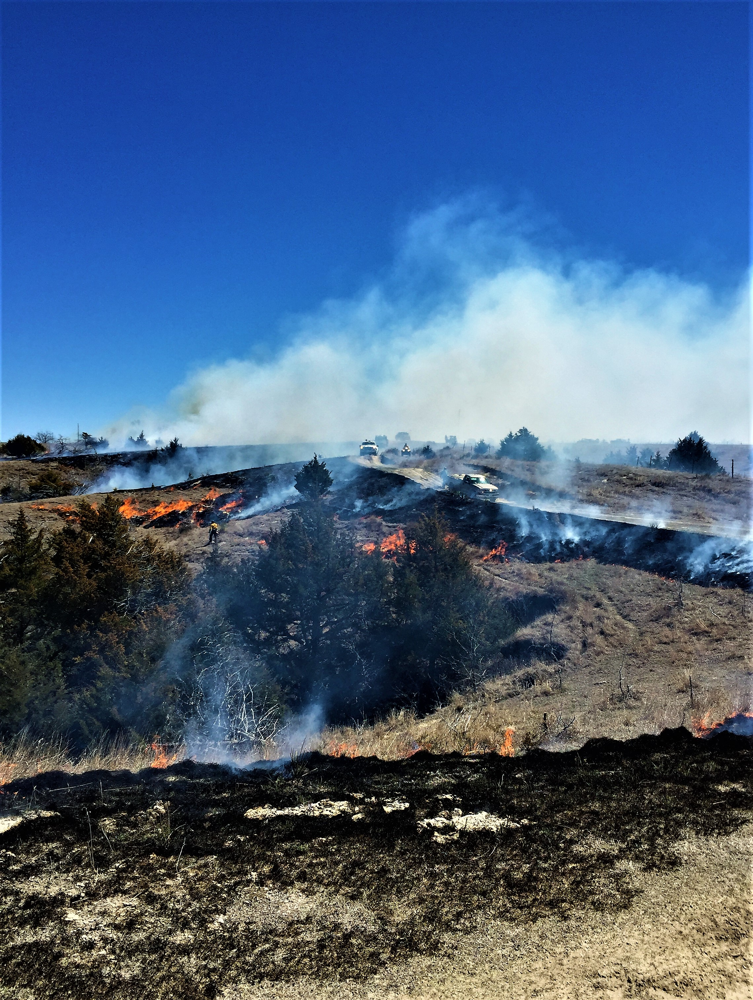

<style>
p.caption {
  font-size: 0.8em;
}
</style>


```{r setup, include=FALSE}
knitr::opts_chunk$set(message=FALSE,warning=FALSE, cache=TRUE)
```

<div class="row">
<div class="col-sm-8">

#### *A rapid mapping tool for quantifying grassland management outcomes*

In grasslands, the North American biome with the greatest loss of biodiversity, documentation of successful restoration and management is imperative for building large-scale restoration programs. However, quantifying outcomes from grassland management efforts is made difficult by the lack of tools to rapidly map and track core grassland habitats and grassland biodiversity responses to management. In this project, we will address this need by developing a rapid mapping tool to quantify grassland management outcomes on public and private lands. To accomplish this, we will complete two objectives: 1) develop a tool to identify and map grassland habitat cores, and 2) use this tool to quantify grassland habitat core and grassland bird community responses to management in and surrounding three US Fish & Wildlife Service Arkansas refuges, focusing on Southeastern grassland species of conservation concern. Tools and products from this project will facilitate grassland management strategies in the Arkansas USFWS refuges, provide grassland bird community and population trends, and will help determine the applicability of this approach for public and private lands across the Southeast region. Other collaborators include Arkansas Game & Fish Commission, USDA Natural Resources Conservation Service, and Quail Forever.

</div>
<div class="col-sm-4">
```{r Bobwhite, fig.cap = "'Northern Bobwhite, Benton Co., IN' by Caleb Putnam is licensed with CC BY-NC 2.0.", out.width='100%', echo=F}
knitr::include_graphics("images/research/Bobwhite_larus10.jpg")
```
</div>
</div>

----

<div class="row">
<div class="col-sm-8">

#### *Assessing Wild Pig Impacts to Ecosystem Services: A Case Study on Diet, Density, and Space Use of Wild Pigs on the South Arkansas National Wildlife Refuge Complex*

Management of invasive wild pig (*Sus scrofa*) populations requires knowledge of local population abundance and density because wild pigs are widespread economic and environmental pests. Additionally, while the effects of wild pigs have been well documented on numerous plant and wildlife communities, the potential effects of wild pigs on avian communities have not yet been assessed. Thus, effective and cost-efficient methods of monitoring wild pig populations must be developed and become an integral component of management. Moreover, little is known about the population-level effects of control efforts on wild pig populations, in large part because methods to estimate wild pig population abundance and density have not been developed, validated, and applied to the same degree as they have with other large mammals. We will use a novel, remote camera-based, modeling approach developed recently by Moeller et al. (2018) for unmarked animals. We propose to conduct our population estimates on the South Arkansas NWR Complex because of its robust pig population, multiple listed species whose current or historic range overlaps, complex lands, the ability to collect data across multiple refuges, existing research equipment and pig removal capabilities, preliminary pig diet and space use data, pig impacts to adjacent private lands, and a willingness among regional stakeholders to coordinate on this project. Additionally, we propose to use the density estimates generated by our remote camera surveillance to assess how the bird community responds to relative pig abundance. Pigs can alter the vegetation community as well as the understory and forest floor through their rutting and foraging behavior. These impacts are likely to alter the available habitat for certain guilds of birds (e.g., ground nesting birds).

</div>
<div class="col-sm-4">
```{r FeralHog, fig.cap = "'Feral hog by water' by Florida Fish and Wildlife licensed with CC BY-NC 2.0.", out.width='100%', echo=F}
knitr::include_graphics("images/research/FeralHog_MyFWC.jpg")
```
</div>
</div>

----

<div class="row">
<div class="col-sm-8">

#### *Impacts of Egyptian Geese and other invasive aquatic avifauna*

Globally, invasive species are one of the biggest drivers of biodiversity and agricultural losses. Motivating and implementing invasive species management before they become overwhelming problems is the most cost effective way to manage invasive species. In Arkansas and many other Southeastern states, Egyptian Geese (*Alopochen aegyptiaca*), a known pest and invader in Europe, are increasing in abundance and distribution. Here, we seek to 1) synthesize existing scientific literature on the impacts of Egyptian Geese and other invasive aquatic avifauna on native ecosystems and agroecosystems and 2) determine current distribution of Egyptian Goose in Arkansas via field surveys. This project is a collaboration between the Arkansas Cooperative Fish & Wildlife Research Unit and Arkansas Game & Fish Commission. Results from this project will arm cooperators with the state of knowledge on impacts of invasive aquatic birds on native species and ecosystems. It will also provide Arkansas Game & Fish Commission with information to develop management policies for Egyptian Geese. 


</div>
<div class="col-sm-4">
```{r EgyptianGeese, fig.cap = "'A pair of Egyptian Geese on Norfolk's river Yare at Brundall' by Ian-S is licensed with CC BY-NC 2.0.", out.width='100%', echo=F}
knitr::include_graphics("images/research/EgyptianGeese_lan-S.jpg")
```
</div>
</div>

----

<div class="row">
<div class="col-sm-8">

#### *Breeding and Migration Ecology and Distribution and Abundance of Arkansas King Rails*

The King Rail (*Rallus elegans*) is an emergent wetland species of high conservation concern in Arkansas and across North America due to significant population declines over the past several decades. The cause of that decline is not well understood but is thought to be caused in part by the loss of large contiguous emergent wetland habitat they rely on for breeding. In Arkansas, King Rail abundance and distribution are unknown, and the one site on public land in the Arkansas Delta that hosts multiple pairs, the Freddie Black Choctaw West WMA (hereafter Choctaw West WMA), also represents a dramatic wetland restoration success that is critical to learn from. Here, we propose to use the Choctaw West WMA as a focal site to 1) evaluate King Rail breeding site fidelity, 2) evaluate King Rail breeding locations, and 3) compare King Rail habitat and abundance to other sites across the Arkansas Delta. We will capture and mark with transmitters spring migrating and breeding King Rails at Choctaw West WMA to evaluate the habitat use of individual birds at Choctaw West WMA as well as the connectivity of the site with the rest of the annual cycle (farther north breeding areas, and southern wintering areas). We will also conduct marsh bird surveys within the Choctaw West WMA and across the Arkansas Delta to quantify King Rail distribution and abundance and compare regional habitat and landscape attributes to Choctaw West WMA attributes. This work will provide AGFC with critical knowledge of King Rail population dynamics, how Choctaw West WMA may function as a source for other sites, breeding habitat needs at local, landscape, and regional scales, and wetland restoration outcomes. 


</div>
<div class="col-sm-4">
```{r KingRail, fig.cap = "'King Rail' by dermoidhome is licensed with CC BY-NC-ND 2.0.", out.width='100%', echo=F}
knitr::include_graphics("images/research/KingRail_dermoidhome.jpg")
```
</div>
</div>

----

<div class="row">
<div class="col-sm-8">

#### *Exploring Eastern Spotted Skunk (Spilogale putorius) distribution and habitat suitability in Arkansas*

The Eastern Spotted Skunk (*Spilogale putorius*) presents a unique conservation challenge: it is in  dramatic decline across its geographic range, yet its basic habitat needs are poorly understood. In Arkansas, little is known about the distribution of the species, particularly in the southwestern portion of the state where at least one recent record of the species has raised interest in understanding how widespread they might be in this region. Here, we propose 1) to use a large number of motion-triggered wildlife cameras (~ 100 cameras) to document the occurrence of Eastern Spotted Skunk over two winter seasons and 2) to create Arkansas-wide habitat suitability maps for Eastern Spotted Skunk. To meet our first objective, we will place clusters of cameras focused on potential den and refuge sites on private properties (pasture and timber) as well as at publicly managed prairie refuges (i.e. Rick Evans Grandview Prairie WMA, Columbus Prairie Preserve, etc). At each camera location, we will record macro and microhabitat variables to correlate with skunk presence or absence. We will use data associated with skunk detections and habitat associations to model potentially occupied habitat in the region. To meet our second objective, we will use nationwide Eastern Spotted Skunk location datasets alongside remotely-sensed land cover/land use datasets to develop species distribution models. We will then use model predictions to map habitat suitability for Eastern Spotted Skunks across Arkansas. Results from this study will provide baseline distributional data for Eastern Spotted Skunk in the region, identify fine- and broad-scale habitat associations, provide habitat suitability maps for Arkansas, and highlight areas for skunk conservation and future monitoring.


</div>
<div class="col-sm-4">
```{r EasternSpottedSkunk, fig.cap = "'Eastern spotted skunk' by FWC Research is licensed with CC BY-NC-ND 2.0.", out.width='100%', echo=F}
knitr::include_graphics("images/research/EasternSpottedSkunk_FWCResearch.jpg")
```
</div>
</div>

----

<div class="row">
<div class="col-sm-8">

#### *Conservation Outcomes in Great Plains Rangelands*

For the past several decades, scientific research has quantified catastrophic outcomes to rangeland resources due to woody plant encroachment, including collapses in livestock production potential and rancher profitability, increasing risks of wildfire danger and water security, displacement of wildlife habitat, and losses to important social and community programs (e.g., revenue generated for public school education). However, scientific documentation of positive conservation management and strategy outcomes is limited. This leads to slower widespread adoption of 'winning' strategies. In this project, we leverage major advancements in monitoring technology (e.g., the Rangeland Analysis Platform) alongside various wildlife datasets to provide more rapid outcomes-generation for partners across the Great Plains. Quantifying spatially-explicit changes in rangeland productivity, cover, and state transitions is central to this approach and have served to better understand complex responses of more specialized outcomes-based assessments. This project is a collaboration between the Arkansas Cooperative Fish & Wildlife Research Unit, University of Montana, University of Nebraska-Lincoln, and Natural Resource Conservation Service (NRCS). Primary project deliverables are (1) a synthesis of existing NRCS technical guidance related to juniper encroachment in the Great Plains, (2) documentation improved management of productivity, cover, state transitions, and grassland wildlife diversity and abundance in the Great Plains. Timely documentation the benefits of new conservation practices will equip agencies and private lands managers to tackle the woody encroachment problem in the Great Plains. 


</div>
<div class="col-sm-4">
```{r ConservationRangelands, fig.cap = "'Prescribed fire in Great Plains' by Caleb Roberts", out.width='100%', echo=F}

```
</div>
</div>

