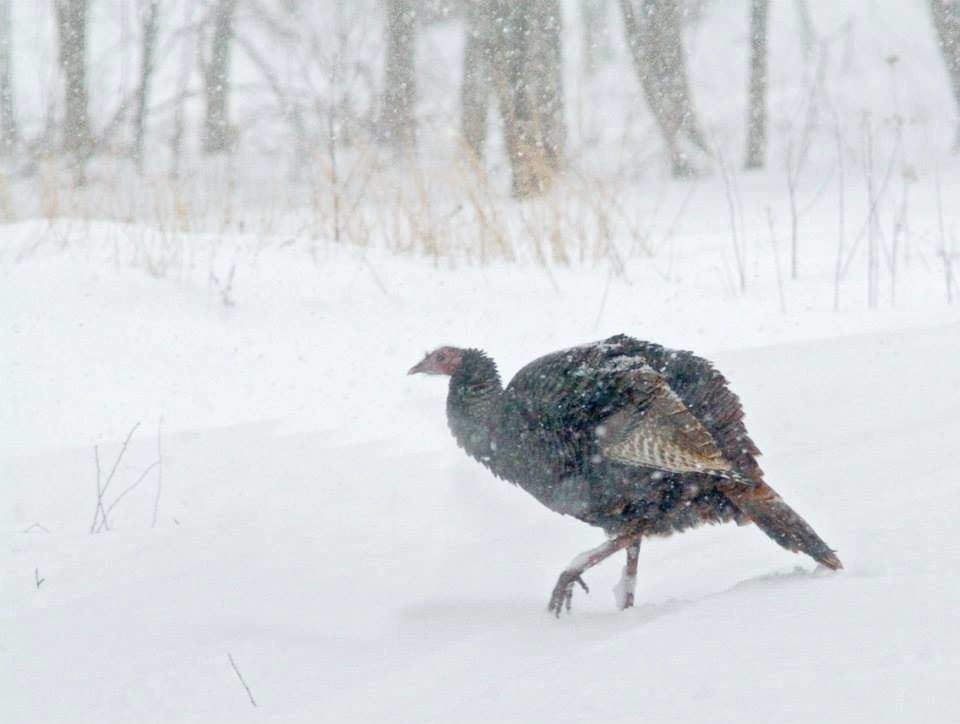
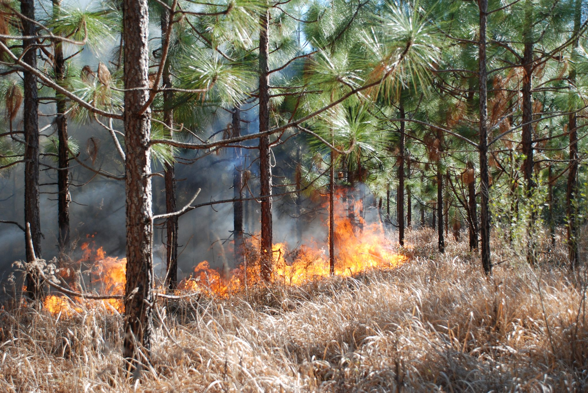
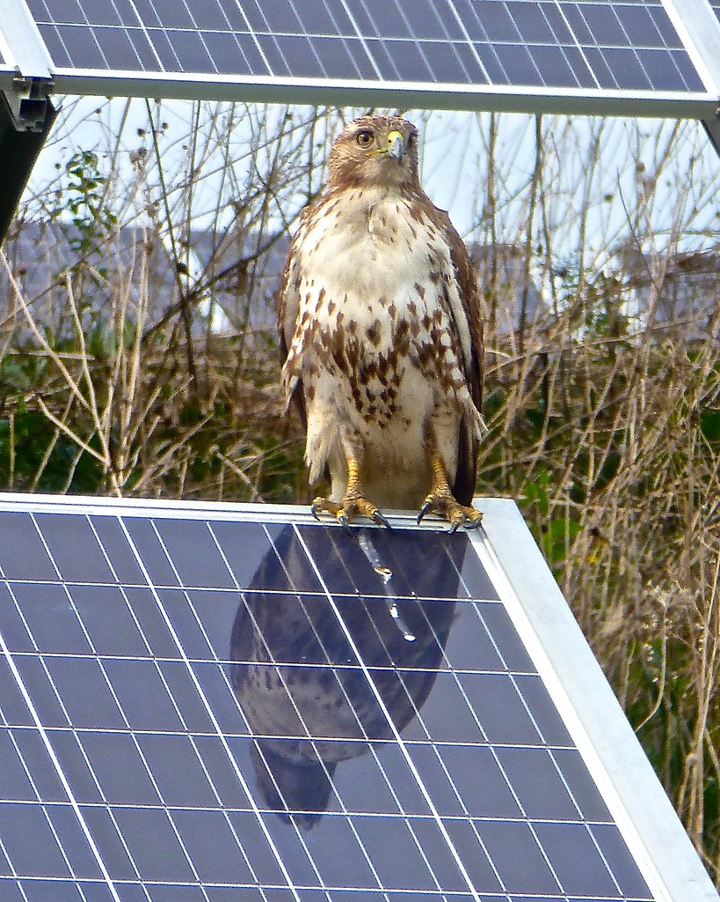
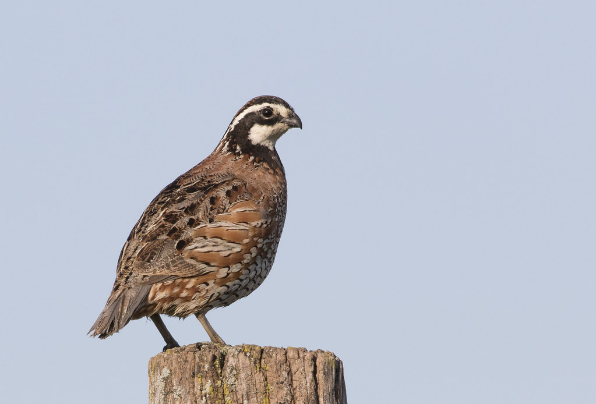
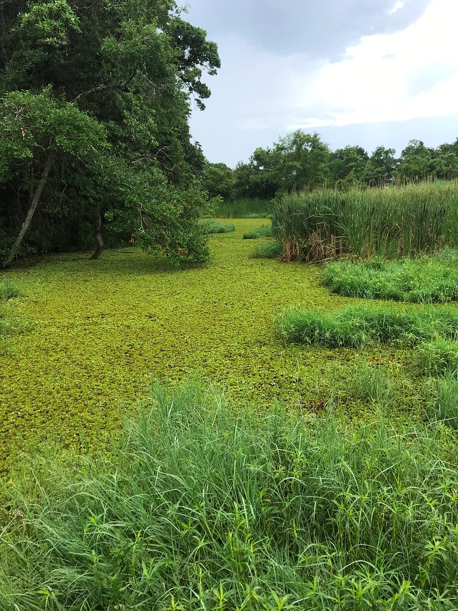

<style>
p.caption {
  font-size: 0.8em;
}
</style>


```{r setup, include=FALSE}
knitr::opts_chunk$set(message=FALSE,warning=FALSE, cache=TRUE)
```

# Current Projects

<div class="row">
<div class="col-sm-8">

#### Toward identifying candidate species for an aquatic nuisance species watchlist in Arkansas: Customizing and improving ecological risk screening summaries for aquatic invasive species

Creating watchlists for potential high-risk invaders can serve as a strong proactive invasive species management tool, but the biggest challenge for creating watchlists is identifying which species out of thousands are “high risk” for becoming harmful invaders. Rapid horizon scans can narrow down non-native species lists from thousands of non-native species to hundreds, and then in-depth risk screening summaries, such as the U.S. Fish & Wildlife Service’s (USFWS) Ecological Risk Screening Summary (ERSS) protocols, can further winnow lists down to a handful of high-risk species. However, there remain key gaps in the USFWS ERSS protocols: the summaries are not tailored for finer-scale ecoregions, the climatic analyses do not account for future climate scenarios, and the literature review for understanding risks of establishment, spread, and impacts is not standardized. To support preventative invasive species management in Arkansas by identifying potential watchlist species, there is a critical need to have and implement a standardized protocol for in-depth ecological risk screening summaries for species that are high-risk for becoming invasive in Arkansas. To fill this need, we propose to customize and improve upon the USFWS ERSS protocols. Our specific objectives are: 1) Customize and make improvements on the USFWS ERSS protocols for Arkansas by (a) tailoring climate matching to Arkansas and (b) developing and implementing a standardized, semi-automatic systematic literature review for high-risk species; and 2) Implement the new Arkansas ecological risk screening summary protocols on the top 10 heighted risk freshwater fish species identified in the U.S. Geological Survey’s Vertebrates in Trade Horizon Scan. As a result of this project, Arkansas will have customized and improved ecological risk screening summary protocols for conducting in-depth risk screening of potential invasive species. We envision these ERSS protocols will fit into an overarching workflow for proactive invasive species management that starts with (i) horizon scanning (rapid risk screening), moves to (ii) ecological risk screening (in-depth risk screening for species flagged in horizon scanning), and then finishes with (iii) considering species categorized as high-risk for addition to an Arkansas aquatic nuisance species watchlist. This project will ensure Arkansas has a clear set of methods for identifying potential watchlist species. 

</div>
<div class="col-sm-4">
```{r ANS, fig.cap = "Image credit: Lindsey LaBrie", out.width='100%', echo=F}
knitr::include_graphics("images/research/InvasiveAquarium.png")
```

</div>
</div>

----

<div class="row">
<div class="col-sm-8">

#### *A statewide decision support tool for turkey conservation in Arkansas: mapping habitat suitability, population growth rates, and where management will be most impactful*

The apparent declines in wild turkey (*Meleagris gallopavo*) populations has led to growing concern in multiple states, and Arkansas is no exception. This has spurred the development of statewide decision support tools, such as habitat suitability models and population density maps, to assist in strategizing large-scale turkey conservation. However, these tools can run afoul of multiple complications: traditional habitat suitability models can oversimplify the diversity of turkey-habitat associations; density maps often provide little new information relative to habitat suitability maps; and neither of these tools account for the reality that conservation decisions are made in the face of complex socio-ecological landscapes, diverse and sometimes competing stakeholders, and limited funds. Therefore, there is a critical need to develop a decision support tool for Arkansas that 1) incorporates spatial non-stationarity into turkey habitat suitability analyses, 2) provides independent, spatially explicit information on turkey population growth rates, and 3) synthesizes turkey habitat suitability, turkey population growth rates, and relevant external socio-ecological information to identify areas where management actions will be most impactful and cost-efficient. Here, our overall goal is to develop and implement a decision support tool that informs wild turkey conservation and management strategies across Arkansas. Specifically, our objectives are: 1) Identify and map important turkey habitat across Arkansas using models that incorporate spatially non-stationary habitat relationships; 2) Estimate and map population growth rates of turkeys across Arkansas; 3) Using information from objectives 1 – 2, identify areas with the greatest potential to positively impact turkey populations through management; 4) Provide technical assistance for development of public-facing data products. The models, data products, and technical assistance we provide will put Arkansas Game & Fish Commission in an ideal position to prevent, halt, or potentially reverse turkey declines in Arkansas.

</div>
<div class="col-sm-4">
```{r Turkey, fig.cap = "'Wild turkey in snow' by USFWS Headquarters is licensed under CC BY 2.0.", out.width='100%', echo=F}

```

</div>
</div>

----

<div class="row">
<div class="col-sm-8">

#### *A National-Scale Early Detection And Ecosystem Service Impact Assessment Tool For Invasive Terrestrial Plants*

Globally, invasive species cause trillions of dollars in damages to ecosystem services, including agricultural production and biodiversity, and these damages will only increase as climate change progresses. The U.S. has adopted early detection and rapid response (EDRR) policies to prevent spread and establishment of invasive species, but implementing a consistent, national-scale EDRR approach has been stymied due to difficulties in (i) accurately predicting where and when invasive species will spread and (ii) consistently estimating invasive species’ impacts on ecosystem services. To overcome these difficulties, our project’s overall goal is to develop and implement a consistent, national-scale EDRR tool that can be adapted to most terrestrial invasive plants. To achieve this goal, we will 1) develop novel early detection methods that predict invasive species’ spread and overcome key modeling limitations, 2) implement our early detection methods on the model system of cogongrass (*Imperata cylindrica*), one of the “world’s worst weeds” and current invader in the U.S., 3) estimate cogongrass impacts on ecosystem services across a gradient of invasion, and 4) use early detection model predictions to map losses in ecosystem services driven by cogongrass invasion under different climate change scenarios, and 5) publish computer code and instructional vignettes to facilitate our EDRR tool’s application for other terrestrial invasive plant species. By synergizing early detection models and ecosystem service impacts, our products will empower stakeholders and private landowners to prioritize proactive management actions at local, regional, and national scales and maximally conserve ecosystem services like biodiversity, timber, and livestock production.

</div>
<div class="col-sm-4">
```{r Cogongrass, fig.cap = "'Cogongrass' by Nancy Loewenstein and John McGuire.", out.width='100%', echo=F}

```

</div>
</div>

----

<div class="row">
<div class="col-sm-8">

#### *WildSNaP: Biodiversity in Solar through Native Planting*

Renewable energy production is exponentially increasing worldwide to reduce greenhouse gas emissions and meet the goals of the Paris Agreement. Solar energy has rapidly expanded across the US landscape to meet the population’s growing energy needs, with a projected increase of solar energy contribution from 3% of total electricity generation in 2020 to 20% in 2050. Solar production in the US is estimated to have increased by 33.2% just in the last year. Production of small-scale residential and commercial solar arrays has increased, but the largest contribution of solar energy growth now comes from utility-scale solar arrays. These arrays are frequently built in agricultural fields or croplands, because the flat open landscape maximizes efficiency of solar power generation and minimizes site preparation activities. There has been a recent movement to plant low-growing native plant communities under solar arrays to reduce the costs associated with turf grass mowing. We are evaluating how the bird, amphibian, pollinator, bat, and mammal communities use solar arrays with an understory of native grasses and forbs compared to sites with turf grass as well as reference sites. Please see the [Willson Lab website](https://www.willsonlab.com/nativesolar) for more details.

</div>
<div class="col-sm-4">
```{r WildSNaP, fig.cap = "'Hawk, reflection in solar array' by Tatiana12 is licensed under CC BY 2.0.", out.width='100%', echo=F}

```

</div>
</div>

----

<div class="row">
<div class="col-sm-8">

#### *King Rail Nest Success and Juvenile Migratory Behavior in Arkansas*

King Rails (*Rallus elegans*) are a secretive marsh bird occurring in emergent wetlands across the eastern United States. King Rails are a species of greatest conservation need in Arkansas and in many species across their range. Despite their conservation status and sharp population declines over the past several decades, we know very little about King Rail breeding ecology and habitat needs, which are all priority information needs across their range. Our previous research has shown King Rails are successfully breeding at Choctaw West Wildlife Management Area in southeastern Arkansas and that the majority of the King Rails at the site are resident (they do not migrate). In this project, we will build on our previous research by investigating 1) whether a King Rail that has hatched to a pair of resident or migratory parents stays resident or migratory its entire life, 2) how factors such as water levels and vegetation structure influence King Rail nesting success. This project will inform habitat management for breeding King Rails at the local and regional scales. 


</div>
<div class="col-sm-4">
```{r BabyKIRA, fig.cap = "King Rail chick by Jess Novobilsky.", out.width='100%', echo=F}
knitr::include_graphics("images/research/BabyKIRA.jpg")
```
</div>
</div>

--- 

<div class="row">
<div class="col-sm-8">

#### *A rapid mapping tool for quantifying grassland management outcomes*

In grasslands, the North American biome with the greatest loss of biodiversity, documentation of successful restoration and management is imperative for building large-scale restoration programs. However, quantifying outcomes from grassland management efforts is made difficult by the lack of tools to rapidly map and track core grassland habitats and grassland biodiversity responses to management. In this project, we will address this need by developing a rapid mapping tool to quantify grassland management outcomes on public and private lands. To accomplish this, we will complete two objectives: 1) develop a tool to identify and map grassland habitat cores, and 2) use this tool to quantify grassland habitat core and grassland bird community responses to management in and surrounding three US Fish & Wildlife Service Arkansas refuges, focusing on Southeastern grassland species of conservation concern. Tools and products from this project will facilitate grassland management strategies in the Arkansas USFWS refuges, provide grassland bird community and population trends, and will help determine the applicability of this approach for public and private lands across the Southeast region. Other collaborators include Arkansas Game & Fish Commission, USDA Natural Resources Conservation Service, and Quail Forever.

</div>
<div class="col-sm-4">
```{r Bobwhite, fig.cap = "'Northern Bobwhite, Benton Co., IN' by Caleb Putnam is licensed with CC BY-NC 2.0.", out.width='100%', echo=F}

```
</div>
</div>

----

<div class="row">
<div class="col-sm-8">

#### *Assessing Wild Pig Impacts to Ecosystem Services: A Case Study on Diet, Density, and Space Use of Wild Pigs on the South Arkansas National Wildlife Refuge Complex*

Management of invasive wild pig (*Sus scrofa*) populations requires knowledge of local population abundance and density because wild pigs are widespread economic and environmental pests. Additionally, while the effects of wild pigs have been well documented on numerous plant and wildlife communities, the potential effects of wild pigs on avian communities have not yet been assessed. Thus, effective and cost-efficient methods of monitoring wild pig populations must be developed and become an integral component of management. Moreover, little is known about the population-level effects of control efforts on wild pig populations, in large part because methods to estimate wild pig population abundance and density have not been developed, validated, and applied to the same degree as they have with other large mammals. We will use a novel, remote camera-based, modeling approach developed recently by Moeller et al. (2018) for unmarked animals. We propose to conduct our population estimates on the South Arkansas NWR Complex because of its robust pig population, multiple listed species whose current or historic range overlaps, complex lands, the ability to collect data across multiple refuges, existing research equipment and pig removal capabilities, preliminary pig diet and space use data, pig impacts to adjacent private lands, and a willingness among regional stakeholders to coordinate on this project. Additionally, we propose to use the density estimates generated by our remote camera surveillance to assess how the bird community responds to relative pig abundance. Pigs can alter the vegetation community as well as the understory and forest floor through their rutting and foraging behavior. These impacts are likely to alter the available habitat for certain guilds of birds (e.g., ground nesting birds).

</div>
<div class="col-sm-4">
```{r FeralHog, fig.cap = "'Feral hog by water' by Florida Fish and Wildlife licensed with CC BY-NC 2.0.", out.width='100%', echo=F}
knitr::include_graphics("images/research/FeralHog_MyFWC.jpg")
```
</div>
</div>

----


# Past Projects

--- 

<div class="row">
<div class="col-sm-8">

#### *Breeding and Migration Ecology and Distribution and Abundance of Arkansas King Rails*

The King Rail (*Rallus elegans*) is an emergent wetland species of high conservation concern in Arkansas and across North America due to significant population declines over the past several decades. The cause of that decline is not well understood but is thought to be caused in part by the loss of large contiguous emergent wetland habitat they rely on for breeding. In Arkansas, King Rail abundance and distribution are unknown, and the one site on public land in the Arkansas Delta that hosts multiple pairs, the Freddie Black Choctaw West WMA (hereafter Choctaw West WMA), also represents a dramatic wetland restoration success that is critical to learn from. Here, we propose to use the Choctaw West WMA as a focal site to 1) evaluate King Rail breeding site fidelity, 2) evaluate King Rail breeding locations, and 3) compare King Rail habitat and abundance to other sites across the Arkansas Delta. We will capture and mark with transmitters spring migrating and breeding King Rails at Choctaw West WMA to evaluate the habitat use of individual birds at Choctaw West WMA as well as the connectivity of the site with the rest of the annual cycle (farther north breeding areas, and southern wintering areas). We will also conduct marsh bird surveys within the Choctaw West WMA and across the Arkansas Delta to quantify King Rail distribution and abundance and compare regional habitat and landscape attributes to Choctaw West WMA attributes. This work will provide AGFC with critical knowledge of King Rail population dynamics, how Choctaw West WMA may function as a source for other sites, breeding habitat needs at local, landscape, and regional scales, and wetland restoration outcomes. 


</div>
<div class="col-sm-4">
```{r KingRail, fig.cap = "'King Rail' by dermoidhome is licensed with CC BY-NC-ND 2.0.", out.width='100%', echo=F}
knitr::include_graphics("images/research/KingRail_dermoidhome.jpg")
```
</div>
</div>

----

<div class="row">
<div class="col-sm-8">

#### *Exploring Eastern Spotted Skunk (Spilogale putorius) distribution and habitat suitability in Arkansas*

The Eastern Spotted Skunk (*Spilogale putorius*) presents a unique conservation challenge: it is in  dramatic decline across its geographic range, yet its basic habitat needs are poorly understood. In Arkansas, little is known about the distribution of the species, particularly in the southwestern portion of the state where at least one recent record of the species has raised interest in understanding how widespread they might be in this region. Here, we propose 1) to use a large number of motion-triggered wildlife cameras (~ 100 cameras) to document the occurrence of Eastern Spotted Skunk over two winter seasons and 2) to create Arkansas-wide habitat suitability maps for Eastern Spotted Skunk. To meet our first objective, we will place clusters of cameras focused on potential den and refuge sites on private properties (pasture and timber) as well as at publicly managed prairie refuges (i.e. Rick Evans Grandview Prairie WMA, Columbus Prairie Preserve, etc). At each camera location, we will record macro and microhabitat variables to correlate with skunk presence or absence. We will use data associated with skunk detections and habitat associations to model potentially occupied habitat in the region. To meet our second objective, we will use nationwide Eastern Spotted Skunk location datasets alongside remotely-sensed land cover/land use datasets to develop species distribution models. We will then use model predictions to map habitat suitability for Eastern Spotted Skunks across Arkansas. Results from this study will provide baseline distributional data for Eastern Spotted Skunk in the region, identify fine- and broad-scale habitat associations, provide habitat suitability maps for Arkansas, and highlight areas for skunk conservation and future monitoring.


</div>
<div class="col-sm-4">
```{r EasternSpottedSkunk, fig.cap = "'Eastern spotted skunk' by FWC Research is licensed with CC BY-NC-ND 2.0.", out.width='100%', echo=F}
knitr::include_graphics("images/research/EasternSpottedSkunk_FWCResearch.jpg")
```
</div>
</div>


----

<div class="row">
<div class="col-sm-8">

#### *Risk assessment for Giant Salvinia in Arkansas waters*

Giant salvinia (*Salvinia molesta*) is the second worst aquatic weed in the world, and in North America it causes millions of dollars in damages per year to agriculture, fishing industries, recreation, ecosystem health, and human health. Giant salvinia is spreading rapidly throughout the Southeastern United States, including Arkansas, and climate change is likely to exacerbate the risk and rate of its spread. A preventative management approach that focuses on early detection and rapid eradication responses will be the most successful and cost effective. We developed and implemented a risk assessment tool that 1) facilitates early detection of giant salvinia by quantifying invasion risk (i.e., the probability of giant salvinia being present given environmental conditions) in Arkansas and 2) determines the difficulty of successfully eradication in water bodies if giant salvinia was introduced (i.e., eradication difficulty), and 3) combines invasion risk and eradication difficulty to rank Arkansas waters according to preventative management priority. We found annual total precipitation, annual minimum temperature, annual maximum temperature, boat access, and number of days below 0 °C were the strongest drivers of giant salvinia invasion risk. Currently in Arkansas, we found no waterbodies with zero invasion risk, but invasion risk was greatest in the south and lowest in the north. Invasion risk rapidly expanded northward under the highest future climate scenario (RCP 8.5): areas in Arkansas with > 60% invasion risk increased from 546 km^2^ to 30,219 km^2^ between now and 2040. For eradication difficulty, we scored 1,120 Arkansas waterbodies according to their ownership, shoreline length (km), woody wetland area (km^2^), and emergent wetland area (km^2^). Combining invasion risk and eradication difficulty scores, we showed that, under current climate conditions, approximately 58% of waterbodies received prioritization ranks of “Medium-low” or lower. Waterbodies falling into “Medium-high” to “Very High” prioritization ranks were mostly between 33°N – 35°N latitude. Overall, although current giant salvinia invasion risk was relatively low for Arkansas, there was a non-zero risk throughout the State. Given the worst future climate scenario, most of Arkansas would be at high risk of invasion < 20 years. To prevent further giant salvinia invasion in Arkansas, our results suggest frequent monitoring of waterbodies with high prioritization rankings and intermittent reassessment of invasion risk as the climate changes. 

</div>
<div class="col-sm-4">
```{r GiantSalvinia, fig.cap = "'Giant Salvinia 3 - Nonnative' by Florida Fish & Wildlife is licensed with CC BY-NC 2.0.", out.width='100%', echo=F}

```
</div>
</div>

----

<div class="row">
<div class="col-sm-8">

#### *Impacts of Egyptian Geese and other invasive aquatic avifauna*

Globally, invasive species are one of the biggest drivers of biodiversity and agricultural losses. Motivating and implementing invasive species management before they become overwhelming problems is the most cost effective way to manage invasive species. In Arkansas and many other Southeastern states, Egyptian Geese (*Alopochen aegyptiaca*), a known pest and invader in Europe, are increasing in abundance and distribution. Here, we seek to 1) synthesize existing scientific literature on the impacts of Egyptian Geese and other invasive aquatic avifauna on native ecosystems and agroecosystems and 2) determine current distribution of Egyptian Goose in Arkansas via field surveys. This project is a collaboration between the Arkansas Cooperative Fish & Wildlife Research Unit and Arkansas Game & Fish Commission. Results from this project will arm cooperators with the state of knowledge on impacts of invasive aquatic birds on native species and ecosystems. It will also provide Arkansas Game & Fish Commission with information to develop management policies for Egyptian Geese. 


</div>
<div class="col-sm-4">
```{r EgyptianGeese, fig.cap = "'A pair of Egyptian Geese on Norfolk's river Yare at Brundall' by Ian-S is licensed with CC BY-NC 2.0.", out.width='100%', echo=F}
knitr::include_graphics("images/research/EgyptianGeese_lan-S.jpg")
```
</div>
</div>

