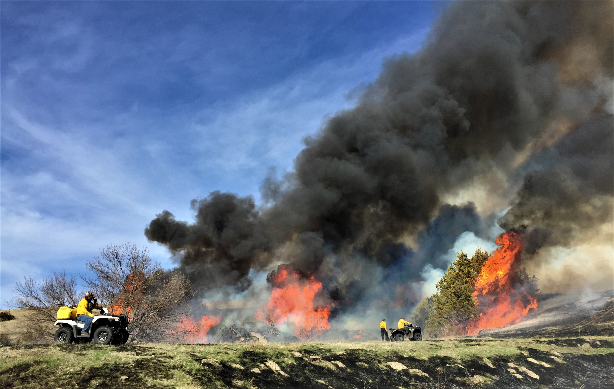

```{r setup, include=FALSE, echo=FALSE}
# Create header.html
CON <- file("header.html")

writeLines('<meta name="twitter:title" content="Living Landscapes Lab ">
<meta name="twitter:description" content=" Lab web page - Caleb Roberts - U.S. Geological Survey">
<meta name="twitter:image" content=" https://LivingLandscapes.github.io/images/LoessCanyons_Fire.JPG">
<meta name="twitter:card" content="summary">',CON)

close(CON)
```

<style type="text/css">
.title {
  display: none;
}

body, td {
  font-size: 13px;
}

#getting-started img {
  margin-right: 0px;
}

.main-container {
  max-width: 1400px;
  margin-left: auto;
  margin-right: auto;
}

</style>

<div class="row">
<div class="col-sm-6"  style="padding-top: 50px;padding-bottom: 200px">

### Welcome to the Living Landscapes Lab website!

We are the Living Landscapes Lab, led by Dr. Caleb Roberts. We are part of the [Arkansas Cooperative Fish & Wildlife Research Unit](https://www1.usgs.gov/coopunits/unit/Arkansas), and our mission is to co-produce research with and provide support for our cooperators at Arkansas Game & Fish Commission, the U.S. Fish & Wildlife Service, the Wildlife Management Institute, the [University of Arkansas](https://fulbright.uark.edu/departments/biology/index.php), and the public. We work closely with cooperators on issues that directly apply to state, regional, and national conservation decisions and management.

If you're interested in joining the Living Landscapes Lab, check out the [job announcements](https://livinglandscapes.github.io/LivingLandscapes_Website/Opportunities.html) or send me an email with your CV and research interests (cr065@uark.edu).

### Contact 

Caleb P. Roberts;
Assistant Unit Leader;
[Arkansas Cooperative Fish & Wildlife Research Unit](https://www1.usgs.gov/coopunits/unit/Arkansas);
U.S. Geological Survey;
Fayetteville, AR, 850 W Dickson St;
Office: SCEN 519
email: cr065@uark.edu 

```{r logo, echo=FALSE, fig.align="left", out.extra="id=logo", out.width="100%"}

```

</div>
<div class="col-sm-6"  style="padding-top: 50px;">

### News

<iframe src="news/news.html" title="news" style='height:700px;width:100%;overflow:auto;border:0px solid #49c5b6;padding:0%'></iframe>

</div>
</div>


